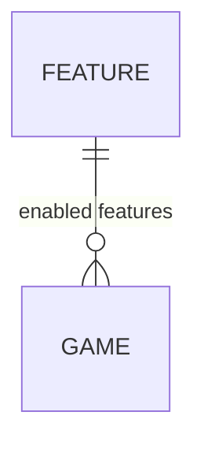

# Game journal backend

This package contains the backend services as lambda functions.

## Schema

This is the data schema.

### Feature

It is a Journal feature. A Game can have one or more features enabled.

A feature has the following fields:

| Field       | Type   | Constraints | Explanation |
|-------------|--------|-------------|-------------|
| id          | string | PK          |             |
| name        | string | NN          |             |
| description | string | NN          |             |

### Game

It represents a game.

A game has the following fields:

| Field       | Type        | Constraints       | Explanation                  |
|-------------|-------------|-------------------|------------------------------|
| id          | string      | PK                |                              |
| name        | string      | NN                |                              |
| features    | FeatureId[] | NN, FK -> Feature | The list of enabled features |
